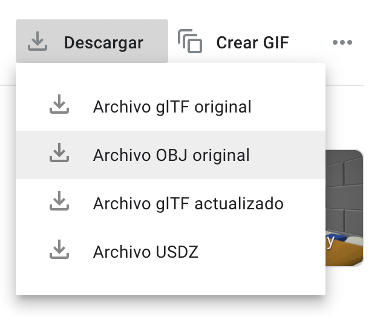
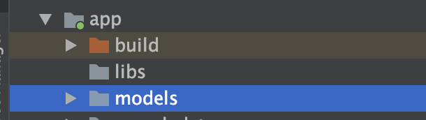
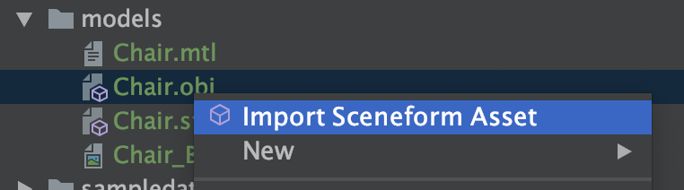

# Sceneform: Making ARCore easier


## What is Sceneform?

It’s a plugin to make an implementation of **ARCore** more straightforward, without the complexity of OpenGL.
You can make a realistic 3D scene in a few minutes with this high level API.

## How to start

First at all we need set up a new project. Let’s start with the dependencies.
 
In the root `build.gradle`, add the class path to the plugin:

```
classpath 'com.google.ar.sceneform:plugin:1.15.0’
```

And in the app `build.gradle`, add the plugin:

```
apply plugin: 'com.google.ar.sceneform.plugin’
```

and the dependencies:

```
implementation 'com.google.ar:core:1.25.0’
implementation 'com.google.ar.sceneform.ux:sceneform-ux:1.15.0'
implementation 'com.google.ar.sceneform:core:1.15.0'
implementation "com.google.ar.sceneform:animation:1.15.0"
```

Finally add the AR camera fragment provided by Sceneform to your `main_activity` layout:

```
<fragment
    android:id="@+id/fragment"
    android:name="com.google.ar.sceneform.ux.ArFragment"
    android:layout_width="match_parent"
    android:layout_height="match_parent" />
```

Now we have our starter setup!

## Importing a model

In order to add a 3D model, you should have one. To do it you can download one from [poly](https://poly.google.com/) or [sketchfab](https://sketchfab.com/).

In this case we will use poly. Choose the model you like and download de obj file. I choose a chair.
Inside the app folder, make another folder called models and place de obj there.




Well, to create de sceneform model we have 2 ways. If you have and older **Android Studio** version you can install a plugin from **Preferences>Plugins**
and search **Google Sceneform Tools (Beta)**. After that simply right click the 3D model source asset and select Import Sceneform Asset to begin the import process.
Click Finish to begin the import process.



But if you have a newest **Android Studio** version you need do it manually, just like this:

In the app `build.gradle`, after all, write:

```
sceneform.asset(
        'models/Chair.obj',         // —> the path to the 3D model
        'default',                  // —> the path to the material
        'models/Chair.sfa',         // —> the output path to the sfa
        'src/main/res/raw/chair'    // —> the output path to the resource
)
```

and rebuild the app.

This should create the new files `Chair.sfa` in the models folder and `chair.sfb` in the raw resources.

Now we are ready to display it on the screen.

## Put the model on the scene

That is very easy, firstly we need cast the fragment to an `ArFragment`, like this:

```
 override fun onCreate(savedInstanceState: Bundle?) {
	super.onCreate(savedInstanceState)
        setContentView(R.layout.activity_main)
        val arFragment = fragment as ArFragment
        // add the model here…
}
```

Finally set the tap listener:

```
// add the model here…
arFragment.setOnTapArPlaneListener { hitResult, plane, motionEvent ->
	val modelRendedable = ModelRenderable.builder()
    		.setSource(this, R.raw.chair)
    		.build()
	CompletableFuture
		.allOf(modelRendedable)
    		.thenAccept { 
			addNode(hitResult.createAnchor(), modelRendedable.get())
		}
}
```
and add the model on the scene:

```
private fun addNode(anchor: Anchor, model: ModelRenderable, view: ViewRenderable) {
    val anchorNode = AnchorNode(anchor)
    val node = TransformableNode(arFragment.transformationSystem).apply {
        renderable = model
        setParent(anchorNode)
        arFragment.arSceneView.scene.addChild(anchorNode)
        select()
}
```

That's all! 

Here is our application working.


## Bonus 1 - Running AR Apps in the Emulator

To do it you might download the ARCore SDK apk from [here](https://github.com/google-ar/arcore-android-sdk/releases)
and install it in your emulator running this command:

```
$ adb install -r /path_to_the_apk/Google_Play_Services_for_AR_1.25_x86_for_emulator.apk
```

## Bonus 2 - Resizing the 3D model

Well, in the sfa file you should see a model node. Inside it is the scale value.
Just modify it, rebuild and run your app.

```
model: {
    attributes: [
      'Position',
      'TexCoord',
      'Orientation',
    ],
    collision: {},
    file: 'models/Chair.obj',
    name: 'Chair',
    recenter: 'root',
    scale: 0.19659799999999999
}
```

Check the complete code in the github [repo](https://gitlab.com/thinkup-public/blogs/android-sceneform-arcore).

